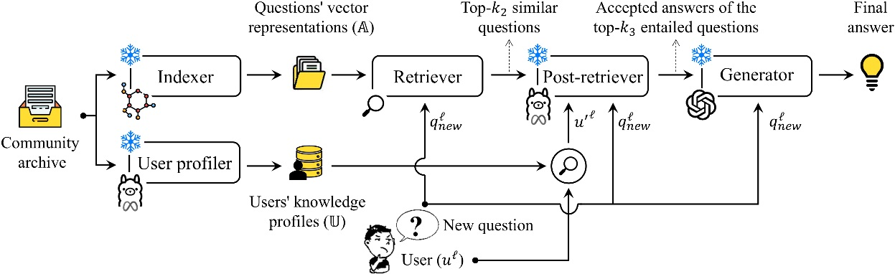

# **Enhancing Reliability in Community Question Answering with an Expert-Oriented RAG System**
## 📜 Abstract

In recent years, pre-trained large language models (LLMs) have become a cornerstone for automatically generating answers in question-and-answer (Q&A) communities, significantly reducing user wait times and improving response quality. However, these models require substantial computational resources and are prone to generating hallucinated or unreliable content. To overcome these limitations, we propose an advanced export-oriented Retrieval-Augmented Generation (RAG) framework as a cost-effective and reliable alternative. Central to our approach is a user-aware question entailment recognition module, which leverages user modeling to identify archived questions with answers that fully or partially address the user's new query. This user modeling significantly improves retrieval relevance, resulting in reduced hallucination and enhanced answer quality. The framework synthesizes expert-written answers from similar questions to generate unified responses. Experimental results on the CQADupStack dataset show that our user-aware approach achieves a 3.6% improvement in ROUGE-1 over its user-agnostic counterpart. Both human and AI evaluations confirm the effectiveness of incorporating user modeling in minimizing hallucination and delivering high-quality, contextually appropriate answers—demonstrating its potential for real-world Q&A systems. 

 

<b> Fig 1. </b> Overview of the advanced knowledge- and retrieval- augmented generation-based community question answering system 

## 🚀 Hyper-parameters

 Here is the list of parameter settings used for fine-tuning each component: 

<table align="center">
  <thead>
    <tr>
      <th>Model</th>
      <th>Hyperparameter</th>
      <th>Value</th>
    </tr>
  </thead>
  <tbody>
    <tr>
      <td rowspan="6">Node2vec</td>
      <td>p</td>
      <td>1</td>
    </tr>
    <tr>
      <td>q</td>
      <td>0.5</td>
    </tr>
    <tr>
      <td>d</td>
      <td>128</td>
    </tr>
    <tr>
      <td>walk_length</td>
      <td>10</td>
    </tr>
    <tr>
      <td>num_walks</td>
      <td>60</td>
    </tr>
    <tr>
      <td>window</td>
      <td>10</td>
    </tr>
    <tr>
      <td rowspan="4">Agglomerative clustering</td>
      <td>metric</td>
      <td>euclidean</td>
    </tr>
    <tr>
      <td>linkage</td>
      <td>ward</td>
    </tr>
    <tr>
      <td>n_clusters</td>
      <td>none</td>
    </tr>
    <tr>
      <td>thresholds</td>
      <td>32, 16, 8</td>
    </tr>
    <tr>
      <td rowspan="9">LLaMA-2</td>
      <td>max_epochs</td>
      <td>10</td>
    </tr>
    <tr>
      <td>learning_rate</td>
      <td>1e-4*, 3e-5+</td>
    </tr>
    <tr>
      <td>batch_size</td>
      <td>32</td>
    </tr>
    <tr>
      <td>max_seq_length</td>
      <td>512*, 750+</td>
    </tr>
    <tr>
      <td>max_new_tokens</td>
      <td>30*, 1+</td>
    </tr>
    <tr>
      <td>lora_r</td>
      <td>64*, 64+</td>
    </tr>
    <tr>
      <td>lora_alpha</td>
      <td>64*, 16+</td>
    </tr>
    <tr>
      <td>lora_dropout</td>
      <td>0.1*, 0.3+</td>
    </tr>
    <tr>
      <td>torch_dtype</td>
      <td>bfloat16</td>
    </tr>
    <tr>
      <td>System</td>
      <td>k_1, k_2, k_3</td>
      <td>10, 50, 3</td>
    </tr>
  </tbody>
</table>

<small>* used for the tag generation task, + used for the RQE task.</small>

 

 For more information about the dataset, please refer to <code>\data\Readme</code>.  
 For experimental results on the research dataset derived from <b>CQADupStack</b>, please refer to <code>\Additional experiments\Readme</code>.  
 For experimental results on the second research dataset, which is a selected subset of the <b>SE-PQA dataset</b>, please refer to <code>\SE-PQA\Readme</code>.  

