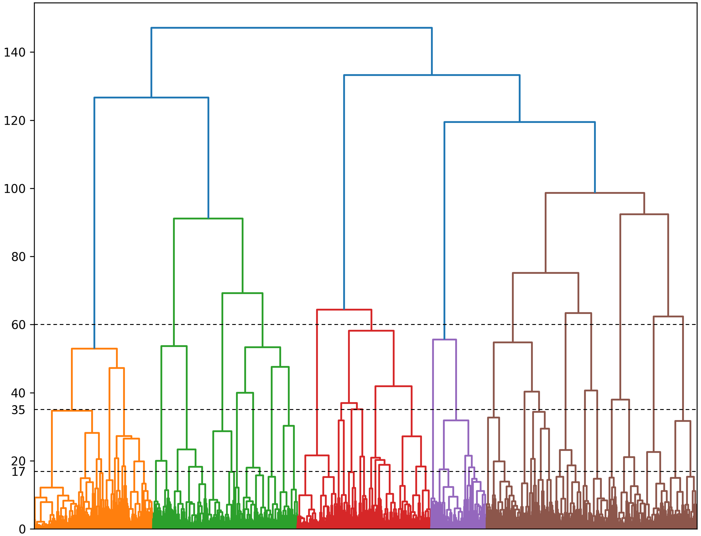

<h3>Experimental results on a selection subset of SE-PQA dataset, matched in size to the research test dataset </h3>

 

<b> Fig 1. </b> The dendrogram with selected thresholds for hierarchical clustering of tags in SE-PQA (Thresholds: 60, 35, 17)
  
 

<table border="0" cellspacing="0" cellpadding="6" align="center">
  <thead>
    <tr>
      <th>Metric</th>
      <th>BERTScore</th>
      <th>ROUGE-1</th>
      <th>ROUGE-2</th>
      <th>ROUGE-L</th>
    </tr>
  </thead>
  <tbody>
    <tr>
      <td><b>Recall-based</b></td>
      <td>1.000</td>
      <td>0.999</td>
      <td>0.998</td>
      <td>0.999</td>
    </tr>
    <tr>
      <td><b>Precision-based</b></td>
      <td>1.000</td>
      <td>0.999</td>
      <td>0.997</td>
      <td>0.999</td>
    </tr>
    <tr>
      <td><b>F1-based</b></td>
      <td>1.000</td>
      <td>0.999</td>
      <td>0.997</td>
      <td>0.999</td>
    </tr>
  </tbody>
</table>

<b> Table 1: </b> Performance Evaluation of LLaMA-2 for Tag Generation on SE-PQA-Based Test Data 

 
<table border="0" cellspacing="0" cellpadding="6" align= "center">
  <thead>
    <tr>
      <th rowspan="2">Model</th>
      <th colspan="2">ROUGE-1</th>
      <th colspan="2">ROUGE-2</th>
      <th colspan="2">ROUGE-L</th>
      <th colspan="2">BERTScore</th>
      <th rowspan="2">BLEU-1</th>
      <th rowspan="2">BLEU-2</th>
      <th rowspan="2">METEOR</th>
      <th rowspan="2">Perplexity</th>
    </tr>
    <tr>
      <th>F1</th><th>Re</th>
      <th>F1</th><th>Re</th>
      <th>F1</th><th>Re</th>
      <th>F1</th><th>Re</th>
    </tr>
  </thead>
  <tbody>
    <tr>
      <td><b>User-agnostic RAG</b></td>
      <td>28.7</td><td>39.4</td>
      <td>6.3</td><td>8.6</td>
      <td>14.6</td><td>21.5</td>
      <td><b>83.2</b></td><td>83.4</td>
      <td>17.9</td><td>7.4</td><td>18.5</td><td><b>31.00</b></td>
    </tr>
    <tr>
      <td><b>User-aware RAG (ours)</b></td>
      <td><b>29.6</b></td><td><b>42.2</b></td>
      <td><b>6.6</b></td><td><b>9.6</b></td>
      <td><b>14.8</b></td><td><b>22.7</b></td>
      <td><b>83.2</b></td><td><b>83.7</b></td>
      <td><b>18.5</b></td><td><b>7.7</b></td><td><b>19.1</b></td><td>32.30</td>
    </tr>
    <tr>
      <td><b>Pre-trained GPT-4o</b></td>
      <td>27.9</td><td>35.0</td>
      <td>5.7</td><td>7.5</td>
      <td>14.5</td><td>19.6</td>
      <td>83.1</td><td>83.2</td>
      <td>15.8</td><td>6.2</td><td>15.9</td><td>39.27</td>
    </tr>
      <tr>
          <td colspan="13"><b>F1</b>: F1-based  <b>Re</b>: Recall-based</td>
      </tr>
  </tbody>
</table>

<b> Table 2: </b> Quantitative Analysis of User-Aware RAG vs. User-Agnostic RAG and Pre-trained GPT-4o on SE-PQA-Based Test Data 

 
<table>
  <thead>
    <tr>
      <th rowspan="2">Metric</th>
      <th colspan="3">Deepseek</th>
      <th colspan="3">Grok</th>
      <th colspan="3">Qwen</th>
    </tr>
    <tr>
      <th> User-agnostic RAG</th>
      <th> Proposed system</th>
      <th> Pretrained GPT-4o</th>
      <th> User-agnostic RAG</th>
      <th> Proposed system</th>
      <th> Pretrained GPT-4o</th>
      <th> User-agnostic RAG</th>
      <th> Proposed system</th>
      <th> Pretrained GPT-4o</th>
    </tr>
  </thead>
  <tbody>
    <tr>
      <th>Hallucination</th>
      <td>4.21</td><td>4.67</td><td>4.44</td>
      <td>4.13</td><td>4.32</td><td>4.22</td>
      <td>4.13</td><td>4.46</td><td>4.49</td>
    </tr>
    <tr>
      <th>Correctness</th>
      <td>3.84</td><td>4.32</td><td>4.30</td>
      <td>3.92</td><td>4.17</td><td>4.24</td>
      <td>3.97</td><td>4.27</td><td>4.35</td>
    </tr>
    <tr>
      <th>Relevance</th>
      <td>4.59</td><td>4.71</td><td>4.75</td>
      <td>4.63</td><td>4.70</td><td>4.87</td>
      <td>4.35</td><td>4.51</td><td>4.71</td>
    </tr>
    <tr>
      <th>Clarity &amp; Conciseness</th>
      <td>3.94</td><td>4.25</td><td>4.84</td>
      <td>4.32</td><td>4.22</td><td>4.84</td>
      <td>3.73</td><td>4.33</td><td>4.68</td>
    </tr>
    <tr>
      <th>Personalization</th>
      <td>3.29</td><td>3.59</td><td>4.02</td>
      <td>3.19</td><td>3.22</td><td>3.43</td>
      <td>3.73</td><td>4.03</td><td>4.56</td>
    </tr>
    <tr>
      <th>Redundancy</th>
      <td>3.84</td><td>4.03</td><td>4.83</td>
      <td>4.46</td><td>4.21</td><td>4.94</td>
      <td>4.14</td><td>4.54</td><td>4.83</td>
    </tr>
    <tr>
      <th>Complexity Appropriateness</th>
      <td>4.86</td><td>4.87</td><td>4.92</td>
      <td>4.86</td><td>4.86</td><td>4.94</td>
      <td>4.25</td><td>4.52</td><td>4.70</td>
    </tr>
    <tr>
      <th>Completeness</th>
      <td>3.68</td><td>4.27</td><td>3.92</td>
      <td>4.11</td><td>4.21</td><td>4.17</td>
      <td>3.87</td><td>4.22</td><td>4.03</td>
    </tr>
    <tr>
      <th>Depth &amp; Detail</th>
      <td>3.86</td><td>4.40</td><td>3.98</td>
      <td>4.03</td><td>4.16</td><td>3.68</td>
      <td>3.75</td><td>4.16</td><td>4.02</td>
    </tr>
    <tr>
      <th>Length Appropriateness</th>
      <td>4.06</td><td>4.24</td><td>4.89</td>
      <td>4.05</td><td>4.06</td><td>4.89</td>
      <td>3.63</td><td>4.21</td><td>4.54</td>
    </tr>
    <tr>
      <th>Similarity score to the gold answer</th>
      <td>2.81</td><td>3.59</td><td>3.84</td>
      <td>2.94</td><td>3.06</td><td>3.29</td>
      <td>2.76</td><td>3.19</td><td>3.65</td>
    </tr>
  </tbody>
  <thead>
    <tr>
      <th rowspan="2">Metric</th>
      <th colspan="3">GPT-4o</th>
      <th colspan="3">GPT-O4-mini</th>
      <th colspan="3">Claude</th>
    </tr>
  </thead>
  <tbody>
    <tr>
      <th>Hallucination</th>
      <td>4.56</td><td>4.76</td><td>4.56</td>
      <td>4.22</td><td>4.63</td><td>4.65</td>
      <td>4.17</td><td>4.33</td><td>4.35</td>
    </tr>
    <tr>
      <th>Correctness</th>
      <td>4.19</td><td>4.40</td><td>4.35</td>
      <td>4.13</td><td>4.48</td><td>4.52</td>
      <td>3.78</td><td>3.97</td><td>4.27</td>
    </tr>
    <tr>
      <th>Relevance</th>
      <td>4.40</td><td>4.57</td><td>4.52</td>
      <td>4.43</td><td>4.60</td><td>4.71</td>
      <td>4.35</td><td>4.40</td><td>4.70</td>
    </tr>
    <tr>
      <td>Clarity &amp; Conciseness</td>
      <td>4.24</td><td>4.46</td><td>4.62</td>
      <td>4.13</td><td>4.44</td><td>4.71</td>
      <td>3.46</td><td>3.44</td><td>4.44</td>
    </tr>
    <tr>
      <th>Personalization</th>
      <td>3.32</td><td>3.48</td><td>3.44</td>
      <td>2.41</td><td>2.56</td><td>2.67</td>
      <td>2.97</td><td>3.05</td><td>3.41</td>
    </tr>
    <tr>
      <th>Redundancy</th>
      <td>4.43</td><td>4.57</td><td>4.68</td>
      <td>4.06</td><td>4.13</td><td>4.75</td>
      <td>3.44</td><td>3.17</td><td>4.32</td>
    </tr>
    <tr>
      <th>Complexity Appropriateness</th>
      <td>4.63</td><td>4.73</td><td>4.76</td>
      <td>4.60</td><td>4.78</td><td>4.89</td>
      <td>3.62</td><td>3.65</td><td>4.06</td>
    </tr>
    <tr>
      <th>Completeness</th>
      <td>4.13</td><td>4.37</td><td>3.79</td>
      <td>4.11</td><td>4.48</td><td>3.97</td>
      <td>3.89</td><td>4.03</td><td>3.95</td>
    </tr>
    <tr>
      <th>Depth &amp; Detail</th>
      <td>4.13</td><td>4.37</td><td>3.76</td>
      <td>4.11</td><td>4.33</td><td>3.75</td>
      <td>3.83</td><td>3.92</td><td>3.43</td>
    </tr>
    <tr>
      <th>Length Appropriateness</th>
      <td>4.27</td><td>4.40</td><td>4.60</td>
      <td>4.17</td><td>4.51</td><td>4.84</td>
      <td>3.32</td><td>3.16</td><td>4.44</td>
    </tr>
    <tr>
      <th>Similarity score to the gold answer</th>
      <td>3.62</td><td>4.00</td><td>3.51</td>
      <td>3.63</td><td>3.97</td><td>3.71</td>
      <td>2.52</td><td>2.65</td><td>3.27</td>
    </tr>

  </tbody>
</table>

<b> Table 3: </b> Qualitative Analysis of User-Aware RAG vs. User-Agnostic RAG and Pre-trained GPT-4o on SE-PQA-Based Test Data 

 
<table border="0" cellspacing="0" cellpadding="6" align="center">
  <thead>
    <tr>
      <th rowspan="2">Metric</th>
      <th colspan="3">AI Evaluator Scores (Mean ± CI)</th>
      <th colspan="3">p-value</th>
    </tr>
    <tr>
      <th>User-agnostic RAG</th>
      <th>Proposed system</th>
      <th>Pre-trained GPT-4o</th>
      <th>User-agnostic RAG vs Proposed</th>
      <th>Proposed vs GPT-4o</th>
      <th>User-agnostic RAG vs GPT-4o</th>
    </tr>
  </thead>
<tbody>
    <tr>
      <td>Hallucination</td>
      <td>4.24&plusmn;0.25</td>
      <td>4.50&plusmn;0.25</td>
      <td>4.49&plusmn;0.22</td>
      <td>1.19E-02</td><td>8.14E-02</td><td>2.60E-01</td>
    </tr>
    <tr>
      <td>Correctness</td>
      <td>3.95&plusmn;0.34</td>
      <td>4.23&plusmn;0.30</td>
      <td>4.37&plusmn;0.23</td>
      <td>1.82E-04</td><td>3.08E-02</td><td>3.54E-01</td>
    </tr>
    <tr>
      <td>Relevance</td>
      <td>4.47&plusmn;0.29</td>
      <td>4.57&plusmn;0.26</td>
      <td>4.73&plusmn;0.14</td>
      <td>5.50E-02</td><td>6.76E-02</td><td>2.14E-01</td>
    </tr>
    <tr>
      <td>Clarity &amp; Conciseness</td>
      <td>3.99&plusmn;0.11</td>
      <td>4.13&plusmn;0.12</td>
      <td>4.71&plusmn;0.10</td>
      <td>1.43E-12</td><td>5.34E-08</td><td>5.34E-08</td>
    </tr>
    <tr>
      <td>Personalization</td>
      <td>3.18&plusmn;0.20</td>
      <td>3.32&plusmn;0.20</td>
      <td>3.67&plusmn;0.14</td>
      <td>1.71E-04</td><td>1.04E-02</td><td>1.04E-02</td>
    </tr>
    <tr>
      <td>Redundancy</td>
      <td>4.08&plusmn;0.11</td>
      <td>4.04&plusmn;0.11</td>
      <td>4.74&plusmn;0.08</td>
      <td>2.51E-01</td><td>2.18E-12</td><td>1.34E-12</td>
    </tr>
    <tr>
      <td>Complexity Appropriateness</td>
      <td>4.46&plusmn;0.18</td>
      <td>4.54&plusmn;0.14</td>
      <td>4.71&plusmn;0.07</td>
      <td>1.02E-02</td><td>7.31E-03</td><td>4.31E-02</td>
    </tr>
    <tr>
      <td>Completeness</td>
      <td>3.96&plusmn;0.30</td>
      <td>4.23&plusmn;0.28</td>
      <td>4.01&plusmn;0.16</td>
      <td>7.23E-04</td><td>4.93E-01</td><td>4.82E-02</td>
    </tr>
    <tr>
      <td>Depth &amp; Detail</td>
      <td>3.94&plusmn;0.28</td>
      <td>4.20&plusmn;0.26</td>
      <td>3.80&plusmn;0.16</td>
      <td>3.59E-03</td><td>1.52E-01</td><td>4.45E-03</td>
    </tr>
    <tr>
      <td>Length Appropriateness</td>
      <td>3.93&plusmn;0.15</td>
      <td>4.03&plusmn;0.15</td>
      <td>4.71&plusmn;0.08</td>
      <td>1.73E-03</td><td>2.30E-12</td><td>7.88E-09</td>
    </tr>
    <tr>
      <td>Comparative vs. Gold Answer</td>
      <td>3.03&plusmn;0.28</td>
      <td>3.35&plusmn;0.29</td>
      <td>3.59&plusmn;0.24</td>
      <td>3.76E-06</td><td>5.38E-03</td><td>2.51E-01</td>
    </tr>
  </tbody>
</table>

<b> Table 4: </b>Statistical Analysis of Answer Generation Systems Based on Scores from Six AI Evaluators on the SE-PQA dataset

